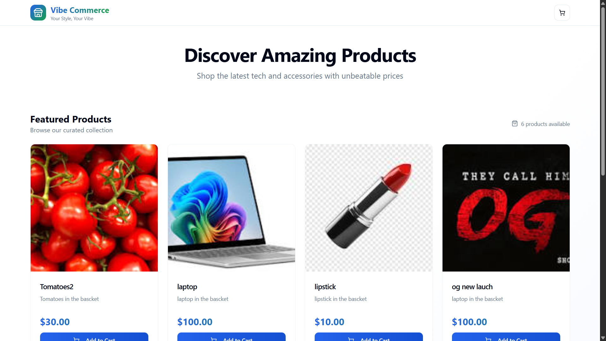
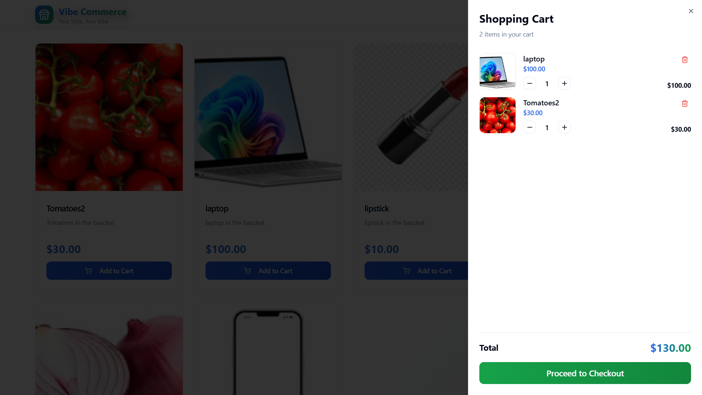
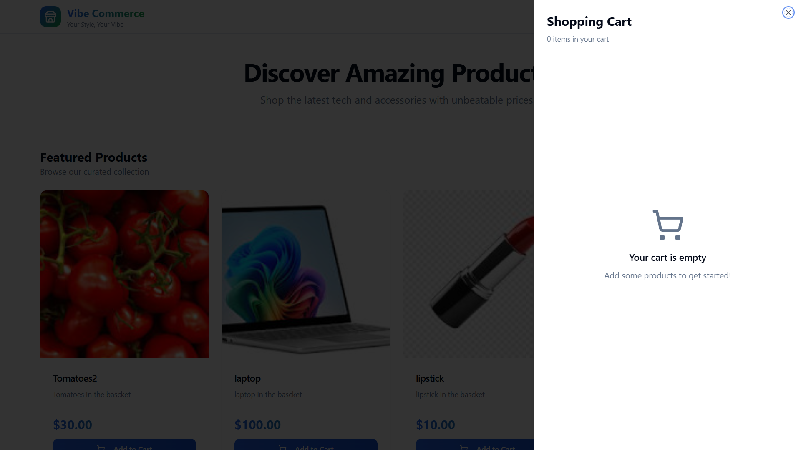
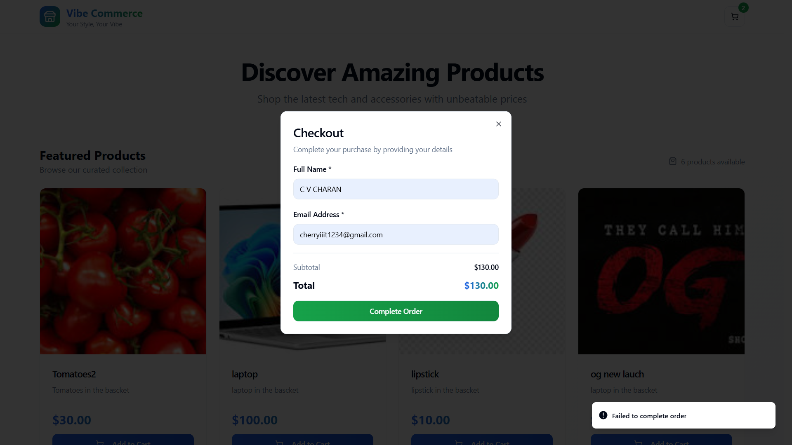

# Commerce Express Cart

A small full‑stack shopping cart demo. Frontend is a Vite + React + TypeScript app (Tailwind + shadcn/ui). Backend is Node.js + Express + MongoDB (Mongoose). This repository is prepared for local grading: the frontend proxies API calls to the local backend.

## Quick summary
- Frontend: `frontend/` (Vite, React + TS)
- Backend: `backend/` (Node, Express, Mongoose)

## Requirements
- Node.js (16+ recommended)
- npm
- MongoDB running locally (or a connection string to a Mongo instance)

## Environment
Create a `.env` file inside the `backend/` folder with at least:

MONGO_URI=mongodb://localhost:27017/commerce-express-cart

You can name the database whatever you like; the default above is used in examples.

## Backend — install, seed, run
1. Open a terminal and change to the backend folder:

```bash
cd backend
```

2. Install dependencies (if you haven't):

```bash
npm install
```

3. Seed the database with sample products (optional but useful):

```bash
npm run seed
```

4. Start the dev server (uses nodemon if present):

```bash
npm run dev
```

The backend listens on port `4000` by default. Ensure `MONGO_URI` points to a reachable MongoDB instance.

## Frontend — install and run
1. In a second terminal, change to the frontend folder:

```bash
cd frontend
```

2. Install dependencies:

```bash
npm install
```

3. Start the dev server:

```bash
npm run dev
```

Vite is configured to proxy `/api` requests to `http://localhost:4000` so both servers should be running while testing locally.

## Smoke test (manual)
1. Open the frontend dev URL that Vite prints (usually `http://localhost:5173`).
2. Browse products, add items to the cart, update quantities, and go through checkout.
3. If you prefer a simple automated check, the backend contains `scripts/smoke.js` which hits the API endpoints. Run it only after the backend is running.

## Notes
- Zod validators are included in the backend code; if you add/remove packages, run `npm install` inside `backend/` before starting.
- This README intentionally excludes any screenshot placeholders as requested.

## Screenshots

Below are a few screenshots from the running app. Images are stored in the `images/` folder.

<p align="center">
	
</p>

_Homepage (products list)_

<p align="center">
	
</p>

_Cart / Checkout view_

<p align="center">
	
</p>

_Empty checkout state_

<p align="center">
	
</p>

_Payment failed example_

If you want the images resized differently, moved to a different folder (for example `docs/screenshots/`), or prefer thumbnails that link to full-size images, tell me which option and I will update the README and move files accordingly.

If you want me to also update the `frontend/README.md` or `backend/README.md`, say so and I will apply the same cleanup.
